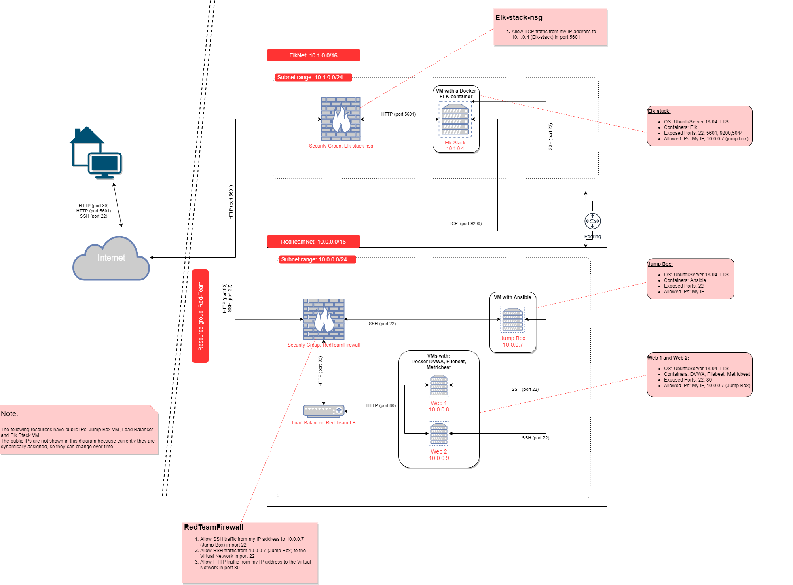

# Elk-Stack-Project

## Automated ELK Stack Deployment

The files in this repository were used to configure the network depicted below.



These files have been tested and used to generate a live ELK deployment on Azure. They can be used to either recreate the entire deployment pictured above. Alternatively, select portions of the Ansible playbook files may be used to install only certain pieces of it, such as Filebeat.

Playbook files:
 1. [Web servers playbook file](Ansible/ansible-playbooks.yml) 
 2. [Elk server playbook file](Ansible/elk-install.yml)
 3. [Filebeat playbook file](Ansible/filebeat-playbook.yml)
 4. [Metricbeat playbook file](Ansible/metricbeat-playbook.yml)


This document contains the following details:
- Description of the Topology
- Access Policies
- ELK Configuration
  - Beats in Use
  - Machines Being Monitored
- How to Use the Ansible Build


### Description of the Topology

The main purpose of this network is to expose a load-balanced and monitored instance of DVWA, the D*mn Vulnerable Web Application.

Load balancing ensures that the application will be highly *available*, in addition to restricting *access* to the network. 
  * The load balancer in this network will protect the availability of the web application. 
  * The advantage of using a jump box in our network is that it is the single point of entry from the internet to our network to manage our virtual machines. 


Integrating an ELK server allows users to easily monitor the vulnerable VMs for changes to the application and system files.
  - Filebeat:
    - Logs information about the file system, in this case it will monitor the Apache server and MySQL database logs generated by DVWA. 
    - It forwards the logs to Elasticsearch or Logstash for indexing.
    - It must be installed in the VMs you want to monitor, in our case the webservers.

  - Metricbeat:
    - Collects metrics from our system and services. 
    - Sends this data to Elasticsearch or Logstash.
    - It also must be installed in the VMs you want to gather data from, in our case the webservers.

The configuration details of each machine may be found below.


| Name      | Function   | IP Address | Operating System |
|-----------|------------|------------|------------------|
| Jump Box  | Gateway    | 10.0.0.7   | UbuntuServer     |
| Web 1     | Web server | 10.0.0.8   | UbuntuServer     |
| Web 2     | Web server | 10.0.0.9   | UbuntuServer     |
| Elk-stack | Elk Server | 10.1.0.4   | UbuntuServer     |


### Access Policies

**The machines on the internal network are not exposed to the public Internet.**

Only the *Jump Box* machine can accept connections from the Internet *via port 22*. Access to this machine is only allowed from the following IP addresses:
- My public IP address 

Machines within the network can only be accessed by the Jump Box via port 22 for configuration purposes.

Access to the ELK VM is allowed from:
- *my public IP address* via *port 5601* (to access Kibana)
- *Web Servers* via *port 9200* (for filebeat and metricbeat purposes)
- *Jump Box* via *port 22* (for configuration purposes) 

A summary of the access policies in place can be found in the table below.

| Name      | Publicly Accessible | Allowed IP Address                                                                     |
|-----------|---------------------|----------------------------------------------------------------------------------------|
| Jump Box  | NO                  | My IP address (port 22)                                                                |
| Web 1     | NO                  | 10.0.0.7 (port 22) My IP address (port 80)                                             |
| Web 2     | NO                  | 10.0.0.7 (port 22) My IP address (port 80)                                             |
| Elk-stack | NO                  | 10.0.0.7 (port 22) 10.0.0.8 (port 9200) 10.0.0.9 (port 9200) My IP address (port 5601) |


### Elk Configuration

Ansible was used to automate configuration of the ELK machine. No configuration was performed manually, which is advantageous because you only have to change the ansible playbook file, then run it and the changes will apply equally to all machines. This way there is no chance of having machines with different cofigurations and it is really easy to add new VMs in case they are needed.

The playbook implements the following tasks:
- Specifies the group of machines that the playbook will affect
- Increases the memory
- Installs docker.io
- Installs python3-pip
- Installs docker using pip
- Downloads and launches a docker ELK container
- Enables docker container on boot

The following screenshot displays the result of running `docker ps` after successfully configuring the ELK instance.


### Target Machines & Beats
This ELK server is configured to monitor the following machines:
- Web 1: 10.0.0.8
- Web 2: 10.0.0.9

We have installed the following Beats on these machines:
- Filebeat
- Metricbeat

These Beats allow us to collect the following information from each machine:
- *Filebeat*: logs with information about changes in the file system, we expect to collect information about SSH logins, sudo commands, new users or groups.
- *Metricbeat*: system statistics, we expect to have information about CPU usage, memory usage, number of containers

### Using the Playbook
In order to use the playbook, you will need to have an Ansible control node already configured. Assuming you have such a control node provisioned: 


SSH into the control node and follow the steps below:
- Create a new directory roles in /etc/ansible
- Create a new directory files in /etc/ansible/roles
- Copy the Ansible playbooks to /etc/ansible/roles:
  - [Web servers playbook file](Ansible/ansible-playbooks.yml) 
  - [Elk server playbook file](Ansible/elk-install.yml)
  - [Filebeat playbook file](Ansible/filebeat-playbook.yml)
  - [Metricbeat playbook file](Ansible/metricbeat-playbook.yml)
- Update the /etc/ansible/hosts file to include the internal network's IP addresses for the web servers and elk server
```bash
 [webservers]
    10.0.0.8 ansible_python_interpreter=/usr/bin/python3
	10.0.0.9 ansible_python_interpreter=/usr/bin/python3
 
 [elk]
    10.1.0.4 ansible_python_interpreter=/usr/bin/python3
```
- Run the playbook, and navigate to <http://[your.ELK-VM.External.IP]:5601/app/kibana> to check that the installation worked as expected.

You should see a page like the following:

- Kibana:


- Filebeat:


- Metricbeat:


